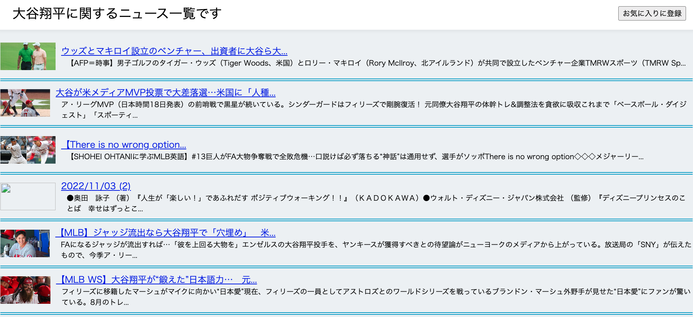

# name

News Searcher

## 概要

- 自分の好きなニュースを検索できます。
- お気に入りに追加するとボタン一つでニュースの検索ができます。
- ※デフォルトでは大谷翔平のニュースが表示されます。

## 使用方法

※デフォルト仕様の場合

1. ページにアクセス後、大谷翔平に関するニュースを確認したい場合「はい」をクリックする
2. ニュースが一覧で表示されるため、気になるニュースのタイトルをクリックするとニュースサイトに飛ぶ
3. 1 で「いいえ」をクリックした場合、検索ワード入力画面になるのでそこで検索したいワードを入力する。
4. ニュース一覧でお気に入り登録すると次回以降お気に入りワードがデフォルトになる

## 要件

ブラウザ上で動作する WEB アプリ

## 注意事項

- news API の無料版なので検索回数は 1 日 100 回まで
- 無料版は CORS 未対応のため GitHub-pages などへのデプロイ不可。

## 文責

- 作成者：Tsukiyama,Rion
- 所属：ロサンゼルス・エンゼルズ

## Licence

NewsAPI 　(https://newsapi.org/)

## 参考文献

NewsAPI 公式 Document (https://newsapi.org/）
